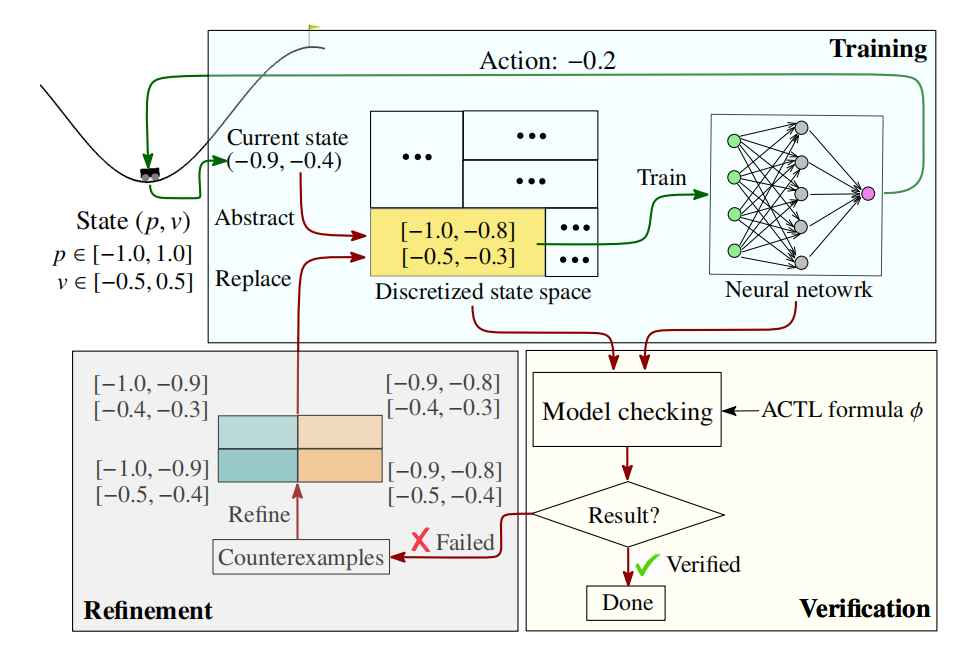
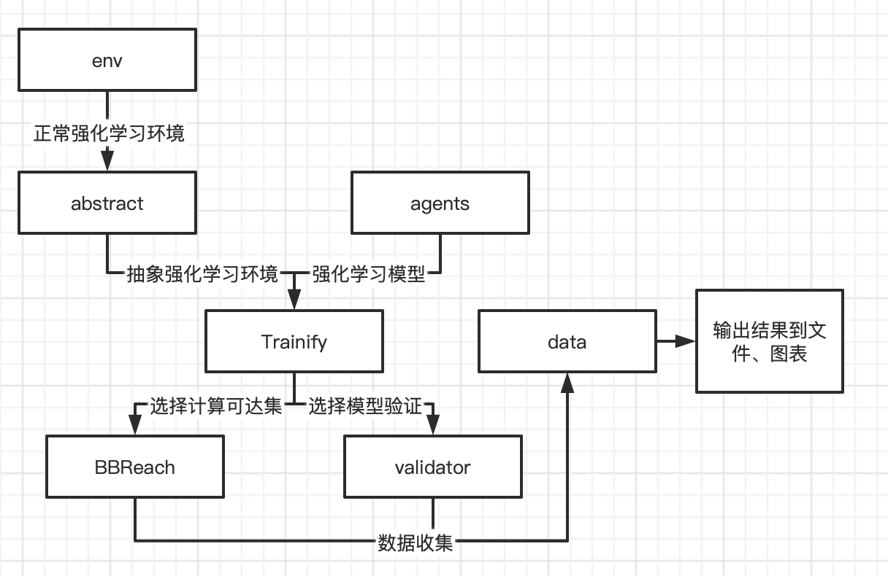

# Trainify-proto 和 BBReach 深度强化学习原型工具

本原型工具主要包含两部分：

第一部分是**已经发表**的CAV 2022(CCF A)
中[Trainify: A CEGAR-Driven Training and Verification Framework for Safe Deep Reinforcement Learning](https://faculty.ecnu.edu.cn/_upload/article/files/39/62/197880be44aba90d9d44ac6de8bb/b7ef9fd1-51e0-4284-8af0-5d7a2f9f1869.pdf)
的原型工具,占整个原型工具的主要部分，Trainify-proto在论文代码的基础上进行了重构改进，增强了易用性、可拓展性和通用性，实现了深度强化学习的自定义抽象训练流程和自选形式化验证等功能。

第二部分是正在审稿中的针对DRL系统进行可达性分析的BBReach工具，通过对可达性分析问题提出了自己的抽象方法。

## 1 原型工具原理简介

### 1.1 Trainify

目前，深度强化学习技术在多个领域（如自动驾驶）中得到了应用。在DRL系统中，深度神经网络被用于进行决策，但是神经网络缺乏可解释性并且容易受到对抗样本的攻击，因此，在DRL系统部署之前为其提供可证明的安全保证是DRL在安全攸关的环境中得到进一步应用的关键挑战。

Trainify是一个针对深度强化学习（DRL）系统的训练和验证框架，通过将验证与训练相结合来得到一个安全的DRL系统。该方法一共包含三块内容：基于抽象状态的训练，构造出Kripke
structure进行模型检测，根据模型检测的结果对抽象状态进行精化，整体流程图如下。



在训练部分，根据一个初始的抽象粒度，连续的状态空间会被划分成有限个抽象状态，我们首先将具体状态映射为抽象状态，决策神经网络接收抽象状态为输入，并输出action。在验证部分，我们会在有限的抽象状态空间上，根据神经网络的决策，构建出Kripke
structure，并且验证由ACTL所定义的性质。如果验证通过则整个过程结束，否则会进入精化阶段，该部分会将验证过程中所返回的不满足性质的抽象状态划分为多个更小的抽象状态，之后重新在精化后的抽象状态空间上进行抽象训练。

### 1.2 BBReach

BBReach是一个针对DRL系统进行可达性分析的技术，该方法同样基于抽象训练的思想。由于可达性分析问题的不可判定性，传统的对DRL系统进行可达性分析的方法不仅需要对系统的dynamics进行过近似，还需要对神经网络的决策进行过近似。双重的过近似会带来更大的过近似误差以及面对大型神经网络的扩展性问题。而BBReach则通过抽象训练的方法来避免对神经网络的过近似，相比于传统的方法，该方法可以高效的计算出更加tight的可达状态集合，并且神经网络的规模大小不会对该方法的效率产生明显的影响。

## 2 安装与使用方式

关于安装，我们提供了三种方式，请针对不同的需求选择：

1. pypi：在终端中执行`pip install Trainify-proto`

   > 如果想体验最新功能，可以安装测试版本
   >
   > pip install -i https://test.pypi.org/simple/ Trainify-proto

2. git clone：通过`git clone`项目到本地，集成进自己的项目中使用,仓库地址:https://github.com/jieye-ericx/Trainify-proto

3. web在线使用：访问http://47.103.212.239:8500/，按照说明使用

不同的使用方式在功能完整性上有一定差异，下面是各功能在不同使用方式上的实现情况：

| 功能              | pypi | git clone | web在线 |
| ----------------- | ---- | --------- | ------- |
| 抽象强化学习训练  | ✅    | ✅         | ✅       |
| 抽象强化学习验证  | ✅    | ✅         | ✅       |
| BBReach可达集计算 | ✅    | ✅         | ❌       |

在未来的版本中，各使用方式的功能会逐步完善。

## 3 原型工具核心模块介绍

打开``Trainify-proto`的包，可以发现主要是如下文件夹：

```bash
data/ # 存储运行时每项任务的模型、日志数据
examples/ # 存储本原型工具提供的案例代码
trainify/ # 存储本原型工具核心源代码
```

打开`trainify`文件夹，目录结构如下：

```bash
abstract/ # 将普通强化学习转为抽象强化学习的工具类模块
agents/ # 自带的强化学习agent/policy类模块
BBReach/ # BBReach 原型工具可达集计算模块
data/ # 专门记录、输出、保存训练时产生的模型数据类模块
env/ # 自带的强化学习环境env类模块
utils/ # 工具函数类模块
validator/ # 形式化模型检查与cegar验证模块
Trainify.py # 本原型工具主进程类
```

`Trainify.py`文件中存放了本工具的入口类，上述各核心模块的调度与使用都由生成的`Trainify`
对象完成，称其为胶水类也不为过，各模块代码之间相互独立，各司其职，耦合性极低，模块之间的关系如图所示：



`abstract`
模块让正常的强化学习环境拥有了进行抽象强化学习的能力，通过调度拥有抽象训练能力的环境和强化学习模型（agent），`Trainify`
可以完成训练过程，接着根据用户的选择可以将训练好的模型用于**形式化模型检查**或**BBReach可达集计算**
，在运行过程中产生的数据会被`data`模块中的`recorder`记录，用于保存数据和各种输出。

## 4 原型工具API介绍

本原型工具主要采用配置项输入的方式，用户准备好自己需要训练的环境（env）和模型（agent）后，只需要和自定义参数一起传入原型工具的API就可以完成第三部分中介绍的实验，我们在`examples/`
目录下为**形式化模型验证**和**BBReach可达集计算**各准备了一个例子，分别为`pendulum.py`和`bbreach.py`
,受制于篇幅，本报告中并未展示，查看请访问[github仓库](https://github.com/jieye-ericx/Trainify-proto)。

构建一个一键自动训练验证的`Trainify`对象很简单，只需要准备好参数传入即可：

```py
t = Trainify(
    env_config=env_config,  # 传入环境配置
    env_class=XXXEnv,  # 传入环境
    agent_config=agent_config,  # 传入模型配置
    agent_class=XXXXAgent,  # 传入模型
    verify=True,  # 是否需要验证，cegar形式化模型验证设置为True，可达集计算设置为False
    verify_config=verify_config,  # 传入验证配置
    experiment_name="xxxx",  # 设置实验名称
    on_episode_end=None,  # 每个episode结束的回调函数
    log_path=None  # 设置数据输出路径，不设置则使用默认路径
)
```

构建好对象`t`后，只需要简单的调用API就可以开始开始相关训练：

```python
t.train_agent()  # 抽象强化学习训练
t.verify_cegar(train_config)  # cegar形式化模型验证
t.train_agent(train_config)  # BBReach可达集计算
```

训练结束后，除了控制台的输出，相关模型、图片已经被保存到了设置的路径下，可以通过`t.recorder.get_data_path()`查看输出的路径。

**附加：tensorboard查看训练/验证结果**

```bash
#在代码中
t.recorder.writeAll2TensorBoard() # 将recorder记录到的数据写入tensorboard文件
# 在终端中
# 先安装tensorboard
pip install tensorboard
# log_dir替换为需要查看的实验目录
tensorboard --logdir=log_dir
```

## 5 Web在线使用与发布

1. Web
   在浏览器中访问：http://47.103.212.239:8500
   为了使本原型工具更易于使用与推广，我们基于最新的技术栈搭建了前后端分离的在线系统，以加速用户的入门，
   前端仓库地址：https://github.com/jieye-ericx/RL-platform-frontend
   后端仓库地址：https://github.com/jieye-ericx/RL-platform-backend
   

2. pypi （用于支持pip下载）

   切换到`publish`分支：`git checkout publish`

   打包：`python setup.py sdist bdist_wheel`

   测试版本：`python -m twine upload --repository-url https://test.pypi.org/legacy/ dist/*`

   正式版本：`python -m twine upload dist/*`
